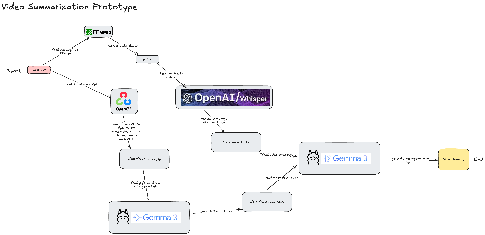

# vid: AI Video Summarizer

vid is a proof-of-concept AI video summarizer that combines video processing and state-of-the-art AI models to generate concise summaries of video content. It leverages frame extraction, audio transcription, and multimodal AI (Gemma via Ollama) to produce high-signal, low-noise video summaries.



## Features
- **Frame Extraction:** Selects key frames from the video using frame difference analysis and similarity filtering.
- **Audio Transcription:** Extracts and transcribes audio using Whisper.
- **Image Description:** Describes selected frames using Gemma (via Ollama).
- **Video Summarization:** Combines transcript and frame descriptions to generate a summary using Gemma.

## How It Works
1. **Audio Extraction:** Extracts audio from the input video (`input.mp4`) and saves as `input.wav`.
2. **Transcription:** Transcribes the audio to text using Whisper and saves to `./out/transcript.txt`.
3. **Frame Selection:** Processes video frames, saving those with significant changes to `./out/frame_XXXX.jpg`.
4. **Frame Filtering:** Removes visually similar frames to reduce redundancy.
5. **Image Description:** Uses Gemma (Ollama) to describe each selected frame, saving descriptions to `./out/frame_XXXX.txt`.
6. **Summarization:** Combines transcript and frame descriptions, prompting Gemma to generate a concise video summary (`./out/summary.txt`).

## Requirements
- Python 3.8+
- [Ollama](https://ollama.com/) (with Gemma model)
- [Whisper](https://github.com/openai/whisper)
- ffmpeg
- OpenCV (`cv2`)
- numpy

Install dependencies:
```bash
pip install -r requirements.txt
```

## Usage
1. Place your video file as `input.mp4` in the project directory.
2. Run the main script:
   ```bash
   python main.py
   ```
3. Find outputs in the `./out` directory:
   - `transcript.txt`: Audio transcript
   - `frame_XXXX.jpg`: Key frames
   - `frame_XXXX.txt`: Frame descriptions
   - `summary.txt`: Final video summary

## System Overview
See `system.png` for a visual overview of the pipeline.

## Notes
- The project is a proof of concept and may require GPU for best performance.
- Gemma and Whisper models must be installed and available to Python.
- Ollama must be running locally with the Gemma model pulled.

## License
MIT